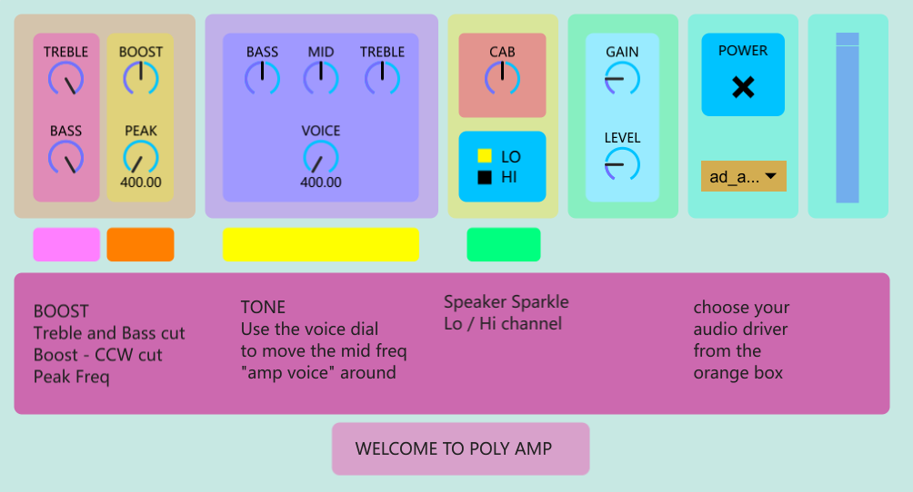

# A software guitar amp built in GEN!

This is the base code for a versatile guitar amp for all sorts of nice sounds.  

## Features:
- Preamp boost with variable centre frequency control and treble and bass cut controls
- 3 Band EQ with variable mid control for all sorts of different amp sounds
- Speaker cabinet sparkle control for bright/warm speaker sounds
- Two channels of differing overdrives.  "LO" channel is a simple hyperbolic tan (tanh) waveshiping thing. "HI" is a stack of triode-like waveshaping things.  See references for source.

## How to use this Amplifer
### _BOOST SECTION_
A boost/cut preamp with additional voice controls.  
- _BOOST_: above 12 o'clock is a 100x volume boost, under 12 is a volume cut (down to 0 gain)
- _PEAK_: the centre frequency of the boost/cut in Hz from 400 to 2400
- _TREBLE_: treble cut in Hz from 5000 at full to 3000
- _BASS_: bass cut in Hz from 300 at full to 25
Use this control to simulate a treble booster, tubescreamer or similar boost pedal.  Can also be used to add a mid scoop before the overdrive and tone although there will be no volume boost for this option

### _TONE_
Active Bass, Middle and Treble controls post-overdrive.  All knobs at noon is a flat response.  Bass and Treble controls are scaled to 0-1 gain under 12 o'clock and 1-10 gain above 12 o'clock.  Mid control is 0-1 under 12 and 1-4 above 12.
- _BASS_: bass shelving filter at 350Hz
- _MID_: peaknotch filter of variable frequency
- _VOICE_: _MID_ control centre frequency in Hz from 400 to 850
- _TREBLE_: treble shelving filter at 3000Hz

### _CAB_
A low pass filter to control speaker high frequencies: 3000 - 6000Hz (see section below on cabsims)

### _CHANNEL_
Two types of overdrive.
- _LO_ is a hyperbolic tangent distortion followed by a lowpass filter
- _HI_ is a non-linear transfer function that simulates a triode vacuum tube.  The algorithm used is linked in the reference section.  Thanks!

### _GAIN_
Does what it says on the tin.  

### _LEVEL_
Output volume.  Owing to the large volume drop in the _HI_ channel this control does slightly different things.  In _LO_ mode this is a simple linear volume control.  In _HI_ the knob is scaled between 0 and 1 under 12 o'clock and between 1 and 10 above.  **THIS WILL CLIP THE OUTPUT** if the gain is set above 12 o'clock and other active volume-boost controls are also set too high so be careful.  For higher gain sounds set the _LEVEL_ control below 12 o'clock. 

### _DRIVER_
This orange box selects the audio-driver of your choice.

## A Short screed on Cab Sims
This software does not contain a "Cab Sim" in the traditional sense (using Impulse Response code).  Partly because I couldn't be bothered but also because there are already 7 independent tone controls before the "cab sim" module (a lowpass filter).  These controls get you 90% of the way there.  It seems a bit redundant to mimic exactly each component of a physical amplifier but that's just my opinion.  This software is not an emulator - it is not attempting to recreate the specific sounds of, say, a JCM800 but is instead a ballpark paint box to experiment with.

## Architecture
- input
- Anti-aliasing filter with a cutoff frequency set at 1/4 of the sampling rate
- Series lowpass filter @3500Hz and highpass filter @35Hz
- Boost and preamp tone controls
- Two channel overdrive
- Two channel lowpass filter
- bass shelf
- treble shelf
- mid peaknotch
- cabsim
- Two channel level control and gain scaling
- output

## THE FUTURE
I am currently working on getting this in a box (minus the treble and bass controls on the boost section for space) using the Electrosmith Daisy.  Using GEN's C-export function this amp could be put into anything!
I've had trouble porting this into a VST as I'm not great with C++ - but hopefully this will follow!

## RESOURCES
https://www.ampbooks.com/mobile/dsp/preamp/
